# Nawady Platform — Complete Mind Map

End-to-end map of the platform: web, mobile apps, API, and database. Use this document to trace any workflow across layers.

**Last updated:** June 2026

---

## 1. Platform Root

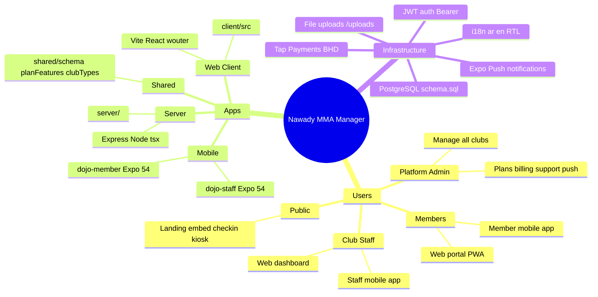

---

## 2. Who Uses What

```mermaid
flowchart LR
  subgraph Public
    L[Landing /]
    E[Embed /embed/:slug]
    K[Check-in /checkin/:slug]
    D[Discover APIs]
  end

  subgraph PlatformAdmin
    PA[Platform Admin UI]
    PA --> PT[tenants plans payments]
    PA --> PS[support push admins leads]
  end

  subgraph ClubStaff
    W[Web Dashboard]
    SA[Staff App]
    W --> API1[/api/* staff/]
    SA --> API1
  end

  subgraph Members
    MP[Web Portal /portal/:slug]
    MA[Member App]
    MP --> API2[/api/portal/*]
    MA --> API2
    MA --> D
  end

  API1 --> DB[(PostgreSQL)]
  API2 --> DB
  PT --> DB
  PS --> DB
  D --> DB
  L --> LEADS[demo_leads]
```

---

## 3. Authentication Flows

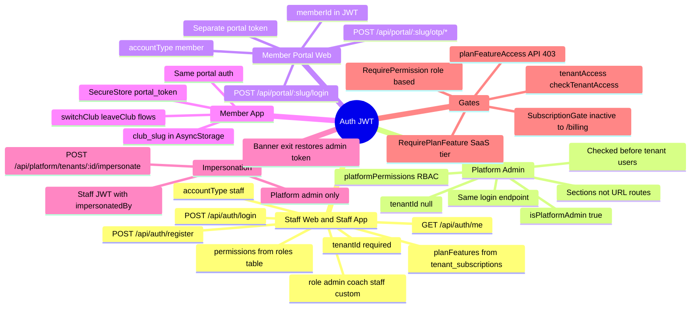

### JWT Payload (`AuthPayload`)

| Field | Purpose |
|-------|---------|
| `userId` | Staff user, platform admin, or member account ID |
| `tenantId` | Club ID (null for platform admin) |
| `email` | Login email |
| `role` | Tenant role or platform role ID |
| `isPlatformAdmin` | Platform operator flag |
| `platformPermissions` | Platform RBAC array |
| `impersonatedBy` | Platform admin ID when impersonating |
| `accountType` | `"staff"` or `"member"` |
| `memberId` | Member ID for portal sessions |

---

## 4. Database — All 42 Tables

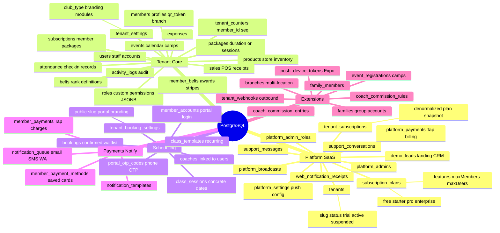

### Table Reference

#### Platform (SaaS operator)

| Table | Purpose |
|-------|---------|
| `subscription_plans` | Nawady SaaS plan catalog (pricing, limits, `features` JSONB) |
| `tenants` | Club accounts (slug, status: active/trial/suspended/cancelled, trial dates) |
| `tenant_subscriptions` | Snapshotted subscription per tenant (plan fields denormalized) |
| `platform_admin_roles` | Platform RBAC presets (`super_admin`, `support`, `billing`, `operations`) |
| `platform_admins` | Platform operator logins |
| `platform_payments` | Tenant→platform billing via Tap |
| `support_conversations` | Tenant support tickets |
| `support_messages` | Messages in support threads (tenant_user / platform_admin / bot) |
| `demo_leads` | Landing-page demo requests CRM |
| `platform_settings` | Key-value platform config (e.g. push) |
| `platform_broadcasts` | Admin broadcast notifications (web + mobile) |
| `web_notification_receipts` | Staff users who dismissed web broadcast popups |

#### Tenant core (staff app)

| Table | Purpose |
|-------|---------|
| `users` | Staff accounts per tenant (email/password, `role`) |
| `roles` | Custom tenant roles with `permissions` JSONB |
| `tenant_settings` | Branding, club type, progression/module/member field config |
| `tenant_counters` | Auto-increment source for `member_id` display numbers |
| `members` | Member profiles (health, docs, `qr_token`, `branch_id`, `custom_fields`) |
| `packages` | Membership products (duration or session-based) |
| `subscriptions` | Active member subscriptions linked to packages |
| `attendance` | Check-in/out records |
| `belts` | Progression rank definitions |
| `member_belts` | Awards per member (with stripes) |
| `products` | Store inventory |
| `sales` | POS transactions / receipts |
| `expenses` | Club expenses |
| `activity_logs` | Audit trail |
| `events` | Calendar notes + camps/tournaments/workshops |

#### Scheduling & bookings

| Table | Purpose |
|-------|---------|
| `coaches` | Coach profiles (optional link to `users`) |
| `class_templates` | Recurring class definitions |
| `class_sessions` | Concrete scheduled sessions |
| `tenant_booking_settings` | Portal config (window, waitlist, Tap, branding, public slug) |
| `member_accounts` | Member portal credentials (phone/password) |
| `bookings` | Session reservations (confirmed/waitlist/cancelled/attended) |
| `portal_otp_codes` | Phone OTP for passwordless portal login |

#### Payments & notifications

| Table | Purpose |
|-------|---------|
| `member_payments` | Member→club Tap charges |
| `member_payment_methods` | Saved Tap cards per member |
| `notification_templates` | Per-event email/WhatsApp/SMS templates |
| `notification_queue` | Outbound notification queue |

#### Phase 2/3 extensions

| Table | Purpose |
|-------|---------|
| `branches` | Multi-location clubs |
| `families` | Family group accounts |
| `family_members` | Members in a family |
| `event_registrations` | Camp/event sign-ups |
| `coach_commission_rules` | Commission config per tenant |
| `coach_commission_entries` | Calculated commission ledger |
| `tenant_webhooks` | Outbound webhook endpoints |
| `push_device_tokens` | Expo push tokens (member + staff) |

---

## 5. Web Client — Routes & Features

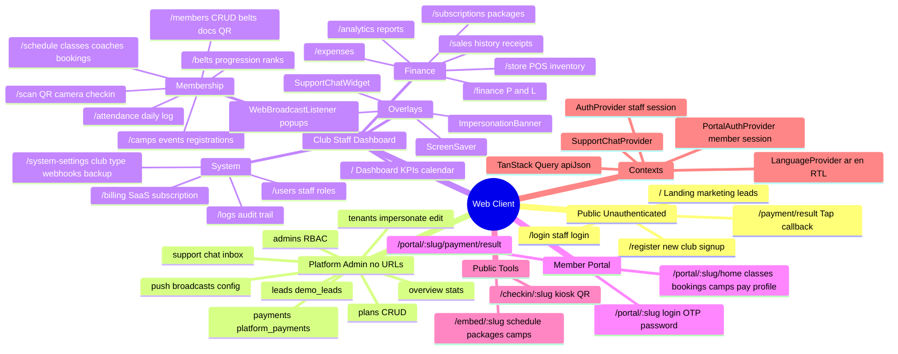

### Shell Routing (`client/src/App.tsx`)

| Path prefix | Shell | File |
|-------------|-------|------|
| `/portal/*` | Member portal | `client/src/pages/portal/index.tsx` |
| `/embed/*` | Public embed widget | `client/src/pages/embed.tsx` |
| `/checkin/*` | Public QR check-in kiosk | `client/src/pages/checkin.tsx` |
| Unauthenticated | Public marketing/auth | `PublicRoutes` |
| `user.isPlatformAdmin` | Platform admin | `client/src/pages/platform-admin.tsx` |
| Authenticated club user | Sidebar + Router | Club staff app |

### Club Staff Routes

| Route | Page | Gate | Purpose |
|-------|------|------|---------|
| `/` | `dashboard.tsx` | — | KPI dashboard |
| `/members` | `members.tsx` | `members.view` | Member CRUD |
| `/attendance` | `attendance.tsx` | `attendance.view` | Daily attendance |
| `/scan` | `scan.tsx` | `attendance.add` | QR scanner |
| `/schedule` | `schedule.tsx` | `classes.view` | Class schedule |
| `/subscriptions` | `subscriptions.tsx` | `subscriptions.view` | Packages + subs |
| `/store` | `store.tsx` | `store.view` + plan `store` | Store + POS |
| `/sales` | `sales.tsx` | `sales.view` + plan `sales` | Sales history |
| `/belts` | `belts.tsx` | `belts.view` + plan `belts` | Belt progression |
| `/analytics` | `analytics.tsx` | `finance.view` + plan `analytics` | Reports |
| `/camps` | `camps.tsx` | `classes.view` + plan `camps` | Camps/events |
| `/finance` | `finance.tsx` | `finance.view` + plan `finance` | P&L report |
| `/expenses` | `expenses.tsx` | `finance.view` + plan `finance` | Expenses |
| `/users` | `users.tsx` | `users.view` | Staff + roles |
| `/logs` | `logs.tsx` | `logs.view` + plan `logs` | Audit log |
| `/system-settings` | `system-settings.tsx` | `settings.view` | Club config |
| `/billing` | `billing.tsx` | — | SaaS subscription |

### Platform Admin Sections (in-app state, not URL routes)

| Section | Panel |
|---------|-------|
| `overview` | Stats + recent tenants |
| `leads` | `platform-leads-panel.tsx` |
| `tenants` | Tenant list, impersonate |
| `plans` | Subscription plan CRUD |
| `payments` | `PlatformPaymentsPanel` |
| `support` | `PlatformSupportPanel` |
| `push` | `platform-push-panel.tsx` |
| `admins` | `PlatformAdminsPanel` |

---

## 6. API Surface

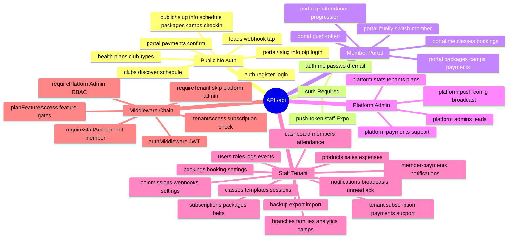

### Middleware Order

1. **Public** — no auth
2. **`authMiddleware`** — Bearer JWT required
3. **Platform routes** — `requirePlatformAdmin` (+ optional `requirePlatformPermission`)
4. **Tenant routes** — `requireStaffAccount` → `tenantAccess` → `planFeatureAccess` → `requireTenant`

### Plan Feature API Gates (`API_FEATURE_GATES`)

These prefixes return 403 if not on plan: `/products`, `/sales`, `/expenses`, `/finance`, `/analytics`, `/camps`, `/belts`, `/logs`, `/webhooks`, `/branches`.

Inactive tenants can still hit: `/tenant/subscription`, `/tenant/payments/*`, `/tenant/support/*`.

---

## 7. Mobile Apps

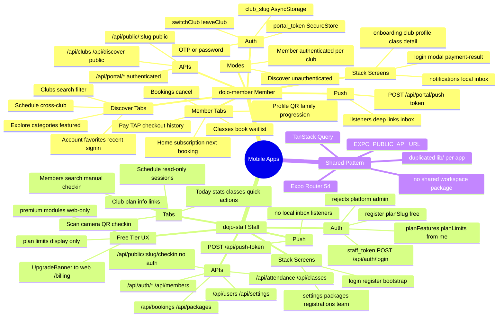

### dojo-member API Endpoints

| Method | Endpoint | Purpose |
|--------|----------|---------|
| GET | `/api/portal/:slug/info` | Club branding |
| GET | `/api/portal/me` | Member session |
| POST | `/api/portal/:slug/login` | Password login |
| POST | `/api/portal/:slug/otp/request` | OTP request |
| POST | `/api/portal/:slug/otp/verify` | OTP verify |
| GET | `/api/portal/classes` | Bookable classes |
| GET/POST/DELETE | `/api/portal/bookings` | Reservations |
| GET | `/api/portal/camps` | Camp list |
| POST | `/api/portal/camps/:id/register` | Camp signup |
| GET | `/api/portal/packages` | Packages |
| GET/POST | `/api/portal/payments` | Payment history + checkout |
| GET | `/api/portal/qr` | Check-in QR |
| POST | `/api/portal/push-token` | Expo token |
| GET | `/api/clubs`, `/api/discover/schedule` | Discover mode |

### dojo-staff API Endpoints

| Method | Endpoint | Purpose |
|--------|----------|---------|
| POST | `/api/auth/login` | Staff login |
| POST | `/api/auth/register` | New club (`planSlug: "free"`) |
| GET | `/api/auth/me` | Session + plan features |
| GET | `/api/attendance?date=` | Today's attendance |
| POST | `/api/attendance` | Manual check-in |
| POST | `/api/public/:slug/checkin` | QR scan (no auth) |
| GET | `/api/members` | Member list |
| GET/PATCH | `/api/settings` | Club settings |
| GET/POST/PATCH | `/api/packages` | Package CRUD |
| GET | `/api/bookings` | Class bookings |
| GET/POST | `/api/users` | Staff + invite |
| POST | `/api/push-token` | Expo token |

---

## 8. Plan Tiers & Feature Gates

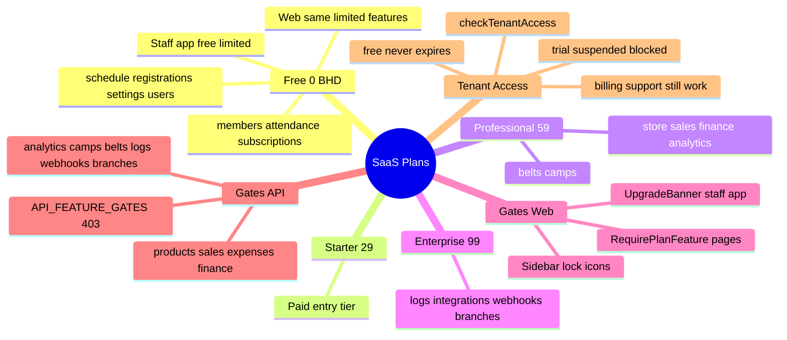

### Feature Matrix

| Feature key | Free | Min paid plan |
|-------------|------|---------------|
| `members` | ✓ | — |
| `attendance` | ✓ | — |
| `subscriptions` | ✓ | — |
| `schedule` | ✓ | — |
| `registrations` | ✓ | — |
| `settings` | ✓ | — |
| `users` | ✓ | — |
| `store` | ✗ | professional |
| `sales` | ✗ | professional |
| `finance` | ✗ | professional |
| `analytics` | ✗ | professional |
| `belts` | ✗ | professional |
| `camps` | ✗ | professional |
| `logs` | ✗ | enterprise |
| `integrations` | ✗ | enterprise |

---

## 9. Club Types (25 Templates)

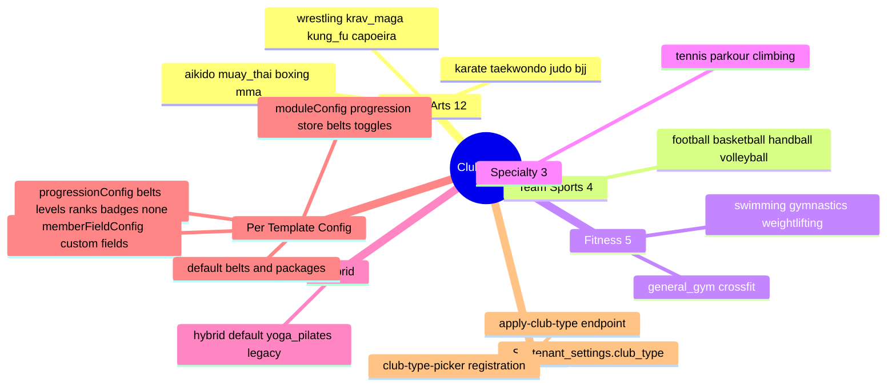

---

## 10. End-to-End Workflows

### A. New Club Signup → First Member

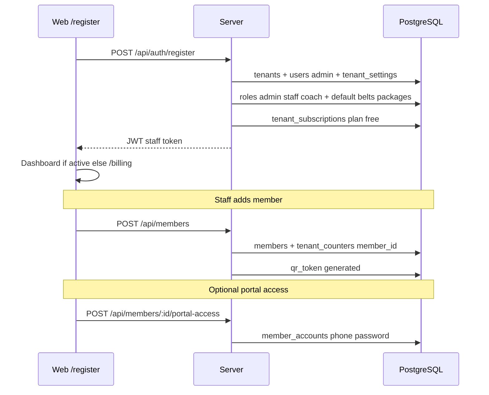

### B. Member Check-in (3 Paths)

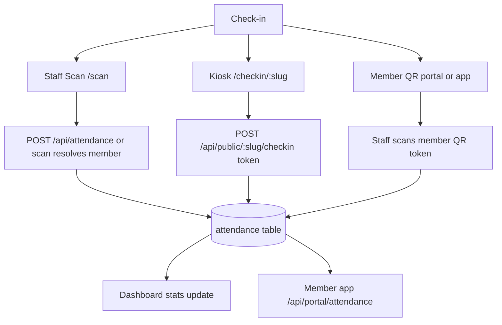

### C. Class Booking

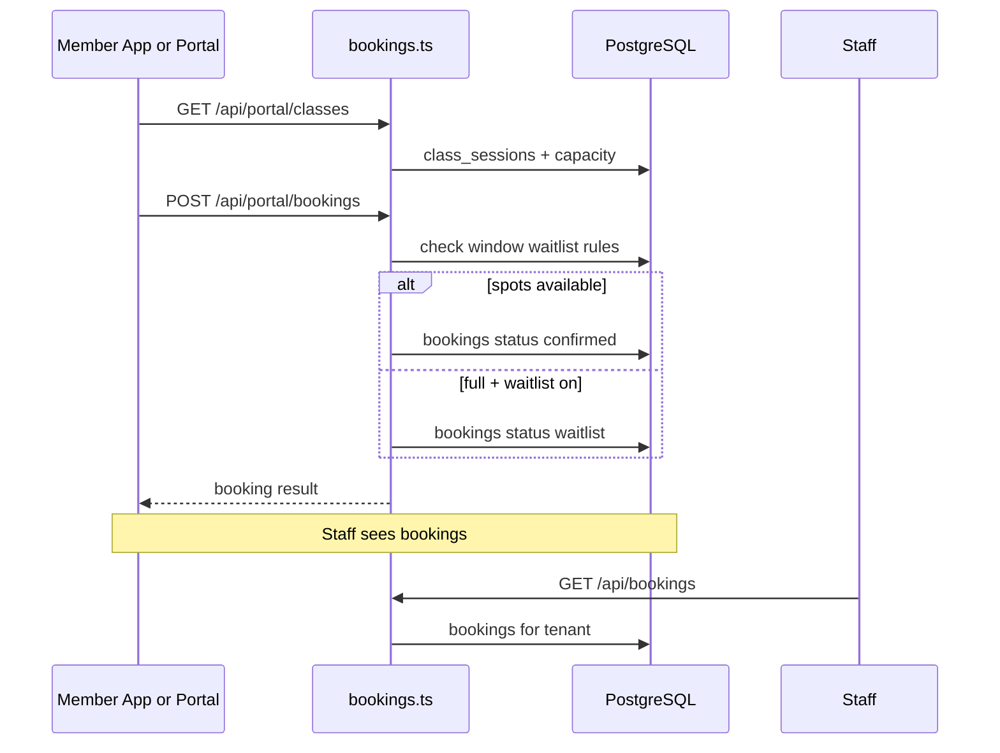

### D. Billing Chain

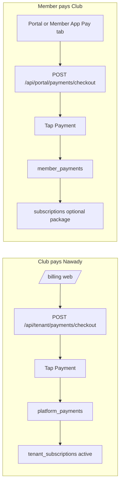

### E. Push Notifications (Platform → Users)

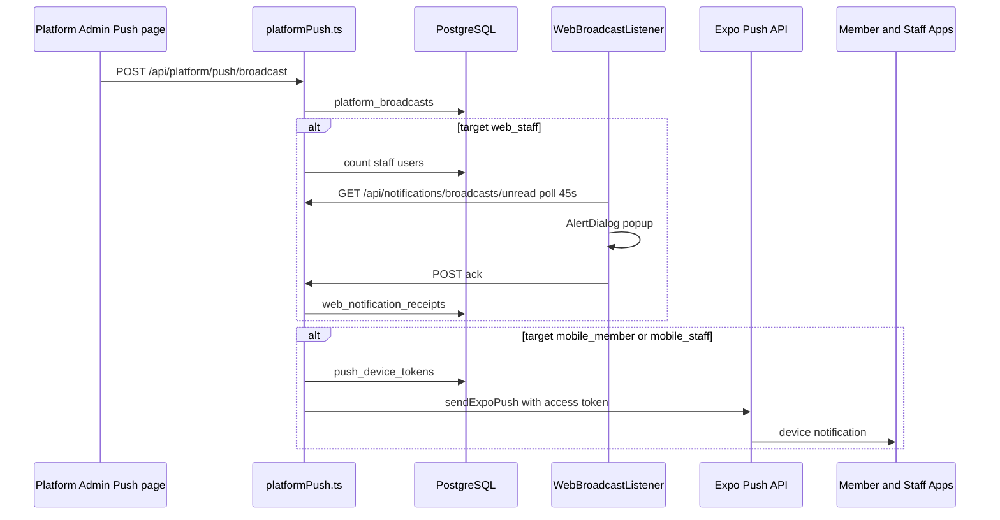

### F. Support Chat

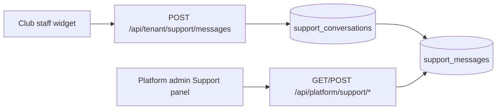

---

## 11. Permissions Layers

| Layer | Where | What |
|-------|--------|------|
| Platform RBAC | `shared/platformPermissions.ts` | tenants, plans, payments, support, push, admins |
| Tenant roles | `roles.permissions` JSONB | members.*, attendance.*, store.*, etc. |
| SaaS plan | `subscription_plans.features` | store, finance, analytics, belts, camps, logs… |
| Club modules | `tenant_settings` club type | progression/store/belts toggles per sport |
| API gates | `API_FEATURE_GATES` | Server 403 on premium endpoints |
| Client gates | `RequirePermission`, `RequirePlanFeature` | Route + sidebar locks |

### Platform Permissions

| Permission | Purpose |
|------------|---------|
| `platform.tenants.view` | List/view tenants |
| `platform.tenants.edit` | Edit tenant status/plan |
| `platform.tenants.impersonate` | Login as tenant admin |
| `platform.plans.view` / `.edit` | SaaS plan management |
| `platform.payments.view` | Platform payment history |
| `platform.support.view` / `.reply` | Support inbox |
| `platform.admins.view` / `.edit` | Platform admin users |
| `platform.push.view` / `.edit` / `.send` | Push broadcasts |

### Tenant Staff Permission Groups

`members.*`, `attendance.*`, `belts.*`, `subscriptions.*`, `store.*`, `sales.*`, `finance.*`, `users.*`, `settings.*`, `classes.*`, `coaches.*`, `bookings.*`, `logs.view`

**System roles seeded per tenant:** `admin` (`["*"]`), `staff` (`[]`), `coach` (classes/bookings/attendance view+add).

---

## 12. File Map (Quick Reference)

| Layer | Path |
|-------|------|
| Web entry | `client/src/App.tsx` |
| Web pages | `client/src/pages/*` |
| Platform admin | `client/src/pages/platform-admin.tsx` |
| API routes | `server/routes.ts` |
| Business logic | `server/data.ts` |
| Bookings | `server/bookings.ts` |
| Push (Expo) | `server/push.ts` |
| Push (platform) | `server/platformPush.ts` |
| Member payments | `server/memberPayments.ts` |
| Tap integration | `server/tap.ts` |
| DB schema | `server/db/schema.sql` |
| Shared types | `shared/schema.ts` |
| Plan features | `shared/planFeatures.ts` |
| Club types | `shared/clubTypes.ts` |
| Platform permissions | `shared/platformPermissions.ts` |
| Member app | `apps/dojo-member/app/*` |
| Staff app | `apps/dojo-staff/app/*` |
| i18n | `client/src/lib/i18n/translations.ts` |

### NPM Scripts

| Script | Purpose |
|--------|---------|
| `npm run dev` | Server + client concurrently |
| `npm run build` | Vite production build |
| `npm start` | Production server |
| `npm run check` | TypeScript check |
| `npm run db:migrate` | Run DB migrations |
| `npm run db:seed` | Seed demo data |
| `npm run mobile:member` | Start member Expo app |
| `npm run mobile:staff` | Start staff Expo app |

---

## 13. Known Gaps & Nuances

- Web portal members do **not** receive platform push popups — only club **staff** on the web dashboard.
- Staff app shows upgrade banners but has **no hard feature gates** on screens (limits are informational).
- Tenant staff permissions are enforced **client-side**; the server does not middleware-check `members.view` etc.
- Member app notification inbox is **local only** (AsyncStorage), not synced from the server.
- `apps/mobile-shared` exists but both mobile apps use duplicated local `lib/` copies.
- Platform admin uses **section state**, not URL routes — `/` means Landing when logged out, Dashboard when logged in as club staff.
- `requireTenant` skips platform admins (`tenantId: null`) so platform routes after tenant middleware work correctly.

---

## 14. Provider Tree (Web)

```
LanguageProvider
  └── QueryClientProvider
        └── AuthProvider
              └── AppShell
                    ├── PortalApp (portal paths)
                    ├── EmbedWidget (embed paths)
                    ├── CheckInPage (checkin paths)
                    ├── PublicRoutes (unauthenticated)
                    ├── PlatformAdmin (platform admin user)
                    └── SubscriptionGate → SupportChatProvider → ThemeProvider → club shell
                          └── WebBroadcastListener
```
